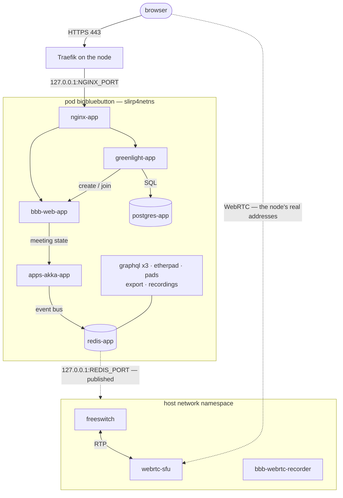

# Service topology

What each systemd unit in `imageroot/systemd/user/` is for, and how they are
ordered. Twenty services and one timer.

The port map and the sizing numbers live in the README's *Architecture*
section; the reasoning behind the port and rootless decisions lives in
[packaging-analysis.md](packaging-analysis.md). This file is the operational
reference: which unit does what, and why three of them are not in the pod.

## The boundary

The pod isolates every container behind slirp4netns, where each packet crosses
a userspace relay. Fine for HTTP, ruinous for RTP. The three media endpoints
therefore stay in the host network namespace — and lose access to the pod's
Redis in the process, which is why the pod publishes it back on the node
loopback.



Only two flows cross the boundary: WebRTC media, which must see the node's real
addresses, and Redis, republished on the host loopback so the three outside
containers stay on the event bus.

## The pod master

| Unit | What it is for |
|---|---|
| `bigbluebutton.service` | Creates the pod and nothing else — no application container. Publishes `127.0.0.1:NGINX_PORT` and `127.0.0.1:REDIS_PORT`, then points every peer name at `127.0.0.1` with `--add-host`, which is BigBlueButton's native addressing. Its `ExecStartPre` runs `render-overrides`. Every pod unit is `BindsTo=` this one. |

## Data

| Unit | What it is for |
|---|---|
| `postgres-app.service` | Greenlight's database (accounts, rooms, recordings) and the one Hasura exposes the meeting views from. |
| `redis-app.service` | The bus every BigBlueButton component talks over. Not the node's Redis, which already owns `127.0.0.1:6379`: this one keeps 6379 inside the pod and is published on `REDIS_PORT`. |

## Meeting core

| Unit | What it is for |
|---|---|
| `bbb-web-app.service` | The BigBlueButton API — `create`, `join`, `end`. Also downloads and converts presentations to SVG, which is the path where the SSRF guard rejects a URL resolving to a loopback address. |
| `apps-akka-app.service` | The meeting state machine: users, whiteboard, breakouts, presentation pods. Its entrypoint also patches `hidePresentationOnJoin` into the HTML5 client settings. |
| `fsesl-akka-app.service` | Turns FreeSWITCH ESL events into Akka messages — who joined the voice conference, who is talking, who is muted. |

## Client state

| Unit | What it is for |
|---|---|
| `bbb-graphql-server-app.service` | Hasura over Postgres. Serves the meeting views the client reads. |
| `bbb-graphql-actions-app.service` | The other direction: client mutations, written onto Redis. |
| `bbb-graphql-middleware-app.service` | The websocket the browser actually connects to. Multiplexes subscriptions in front of Hasura. |

## Collaboration

| Unit | What it is for |
|---|---|
| `etherpad-app.service` | The pad engine behind shared notes and captions. |
| `bbb-pads-app.service` | BigBlueButton's wrapper around Etherpad: creates and destroys one pad per meeting, and owns the access rules. |
| `bbb-export-annotations-app.service` | Flattens whiteboard annotations onto the slides, for download and for recordings. |

## Front

| Unit | What it is for |
|---|---|
| `nginx-app.service` | The single HTTP entrypoint. Serves the HTML5 client and `/default.pdf` from `/www/`, proxies `/` to Greenlight, and gates the graphql, pad and sfu routes behind `auth_request`. |
| `greenlight-app.service` | The Rails front end: accounts, rooms, room presentations, recording library. Its entrypoint appends the public name to `/etc/hosts` pointing at the pod's nginx, and trusts the internal certificate. |
| `greenlight-seed-admin.service` | Creates the bootstrap administrator. Deliberately not an `ExecStartPost` of Greenlight: that fires when `podman run -d` returns, while Greenlight is still migrating and the users table does not exist. Pulled in by `Wants=`, and returns immediately once an administrator exists. |

## Recording

| Unit | What it is for |
|---|---|
| `recordings-app.service` | The archive → sanity → process → publish → notify pipeline. The last stage calls Greenlight back on the public name, so without the internal certificate a recording publishes but never appears in any room's library. |

## Outside the pod

These three run with `--network=host` and are `Wants=` rather than `BindsTo=`
the pod unit.

| Unit | Why it is outside |
|---|---|
| `freeswitch.service` | The audio conference bridge. It trades RTP with the SFU on every conference leg; inside the pod each packet would cross rootlessport in userspace. ESL 8021 and SIP-over-WebSocket 5066 keep their defaults; the RTP range is allocated because FreeSWITCH's own default overlaps the allocator span. |
| `webrtc-sfu.service` | The mediasoup SFU. WebRTC media must bind the node's real addresses. That plus `seccomp=unconfined`, needed for io_uring, makes it the widest trust boundary in the stack. |
| `bbb-webrtc-recorder.service` | Records webcam and screen-share streams, same namespace reason. It creates its own mount point rather than letting podman do it: podman creates a missing mount point owned by root, so whichever of this container and `recordings-app` started last decided the owner, and losing that race produced sound over a blank picture. |

## Maintenance

| Unit | What it is for |
|---|---|
| `bigbluebutton-periodic.timer` | Fires 15 minutes after boot, then every 30 minutes. The initial delay lets the stack settle rather than firing into a half-started pod. |
| `bigbluebutton-periodic.service` | Four jobs, with no `set -e` so one failure does not stop the rest: resync the FreeSWITCH clock, check an administrator exists, drop presentation upload directories older than 5 days, apply recording retention. Replaces the upstream `periodic` container, which existed only to hold the Docker socket. |

## Startup order

The `After=` declarations are not parallel layers but a chain. The longest one
is ten units deep:

```
bigbluebutton → redis-app → etherpad-app → bbb-pads-app → bbb-web-app
  → bbb-graphql-server-app → bbb-graphql-middleware-app → nginx-app
  → greenlight-app → greenlight-seed-admin
```

Every unit not on that path hangs off one of its links; none of them make it
longer. This is why the public name answers 502 for the first minute after a
pod restart — the chain has not reached Greenlight yet.

## Notes for debugging

- `bigbluebutton.service` carries `ExecStartPre=runagent render-overrides`, and
  restarting *any* pod member pulls that in. A hand edit under
  `state/overrides/` is therefore wiped on the next start. To test a template
  change without rebuilding the image, patch `$AGENT_INSTALL_DIR/overrides/`
  instead — that is what the render reads.
- `runagent -m <module_id> journalctl --user` fails with a permissions error.
  Read the module's logs as root with
  `journalctl _UID=$(id -u <module_id>)`.
